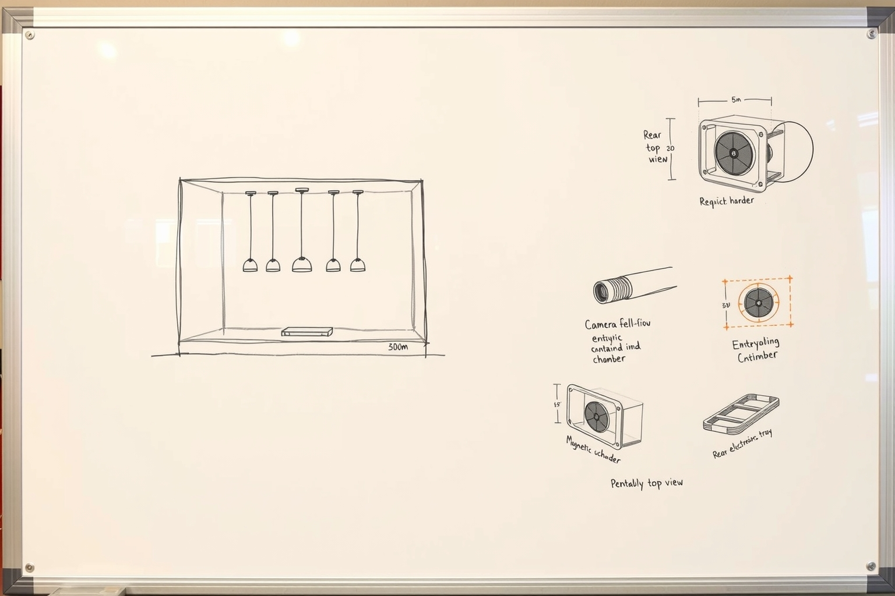

# entropy c

A portable physical-entropy experiment for Cloudflare's New York City office.

**Entropy, see?**

`entropy c` explores a small, quiet, plug-in installation that observes chaotic physical motion, extracts measurements locally, and sends signed telemetry through Cloudflare infrastructure. It will be built and tested at home first, then carried into the NYC office as a self-contained demo.

> [!IMPORTANT]
> This is an experiment, not a production random-number service. Its output must not be used for cryptographic key generation or as a replacement for an operating system CSPRNG without formal design review, threat modeling, statistical analysis, and security approval.

## Goals

- Portable: one enclosure, USB-C power, Wi-Fi, and optional Ethernet/PoE.
- Visually legible: the physical process should make randomness tangible.
- Quiet and low-maintenance enough for an office.
- Outbound-only: no local inbound service is required.
- Offline-tolerant: measurements buffer locally and resume after reconnecting.
- Observable: source health, extraction activity, and upload receipts are visible.
- Cloudflare-native: Workers, Durable Objects, Queues, Workflows, R2, D1, and Access.
- Honest: distinguish measured physical entropy, device randomness, public context, and decorative inputs.

## What other installations teach us

Cloudflare's best-known entropy installation is the wall of lava lamps in San Francisco. A camera observes the changing scene and the captured images contribute unpredictable input to a larger randomness system. Cloudflare has also publicly described the broader principle: a physical source is an additional input, not a reason to discard conventional cryptographic randomness.

The useful design pattern is:

1. Observe a chaotic physical process.
2. Collect high-dimensional measurements such as images.
3. Condense observations with a cryptographic hash or extractor.
4. Mix the result with independent secure randomness.
5. Monitor source health and fail safely.
6. Never make a consumer block on the art installation.

Office installations can use different physical phenomena. The durable idea is not lava specifically; it is a compelling chaotic source, careful extraction, independent fallback randomness, and transparent operation.

Public background:

- [Cloudflare: Randomness 101 — LavaRand in Production](https://blog.cloudflare.com/randomness-101-lavarand-in-production/)
- [Cloudflare: How do lava lamps help with Internet encryption?](https://www.cloudflare.com/learning/ssl/lava-lamp-encryption/)
- [Cloudflare: The League of Entropy](https://www.cloudflare.com/leagueofentropy/)
- [drand: distributed randomness beacon](https://drand.love/)

## Leading concept: NYC Traffic Prism

[](mockups/whiteboard.html)

**[Open the grounded concept board](mockups/whiteboard.html)** to see which parts are requirements, candidates, unmade decisions, and explicitly out of scope.

A compact transparent shadow box contains several prisms, reflective pieces, or translucent elements moved by quiet motors or magnetic actuators. A camera observes the changing optical field. Motion, light, and environmental sensors provide independent measurements.

The whiteboard is a direction, not a specification. The enclosure geometry, five-object arrangement, magnetic actuation, and 300 mm scale are design hypotheses. The staged architecture, privacy boundary, fail-safe behavior, and non-production warning are project requirements.

Live traffic data can influence the installation's color, rhythm, or motor cadence. It should be treated as **public context or an additional mixed input**, not as secret entropy: network traffic can be observed or influenced by other parties.

Possible behavior:

- Traffic volume controls the installation's pulse.
- Traffic composition controls LED color.
- Traffic deltas perturb motor timing.
- Physical motion and camera sensor noise remain separately measured.
- The display shows health and provenance rather than claiming a magical “randomness score.”

## Candidate hardware

The initial M5Stack-oriented shortlist is deliberately modular:

- **Controller:** M5Stack CoreS3 or CoreS3 SE (ESP32-S3, display, Wi-Fi, compact enclosure).
- **Camera:** an M5Stack camera unit or an isolated USB/network camera connected through a companion processor.
- **Motion:** IMU in the controller plus an external accelerometer if the moving assembly needs direct measurement.
- **Light:** ambient-light sensor and/or spectral/color sensor.
- **Environment:** temperature, humidity, and pressure sensor for additional telemetry—not automatically credited as entropy.
- **Actuation:** quiet DC gear motor, stepper, servo, or magnetic actuator with a dedicated driver.
- **Independent randomness:** the controller's hardware RNG, optionally supplemented by a reviewed external hardware source.
- **Connectivity:** Wi-Fi at home; optional Ethernet/PoE module for a stable office installation.
- **Power:** one USB-C input with a fused, enclosed low-voltage power stage.

Exact parts and prices will be recorded in a bill of materials after compatibility and availability checks.

## Proposed architecture

```text
physical source + sensors + camera
              │
              ▼
        M5Stack controller
        ├─ sample and timestamp
        ├─ run health checks
        ├─ hash/extract observations
        ├─ mix with device CSPRNG
        ├─ sign observation envelope
        └─ buffer during outages
              │ outbound HTTPS
              ▼
       Access-protected Worker
              │
       Durable Object per device
       ├─ identity and sequence checks
       ├─ replay protection
       ├─ current health
       └─ live updates
              │
       Queue / Workflow
       ├─ D1: metadata and receipts
       ├─ R2: sampled evidence
       └─ observability and UI
```

The prototype will not upload a continuous office camera feed. Raw images should remain local by default. A sampled or explicitly enabled evidence mode may retain carefully framed images during home testing; office use requires privacy and physical-security review.

## Observation envelope

Telemetry should describe what was measured without exposing reusable random output:

```json
{
  "device_id": "nyc-entropy-01",
  "boot_id": "random-per-boot-id",
  "sequence": 18422,
  "captured_at": "2026-06-18T09:00:00Z",
  "firmware_version": "0.0.1",
  "sources": {
    "camera": {
      "frame_commitment": "sha256:...",
      "difference_score": 0.71,
      "healthy": true
    },
    "motion": {
      "sample_count": 128,
      "variance": 0.043,
      "healthy": true
    },
    "device_rng": {
      "bytes_mixed": 32,
      "healthy": true
    }
  },
  "previous_receipt": "sha256:...",
  "payload_commitment": "sha256:...",
  "signature": "..."
}
```

This schema is provisional. A production design would need a defined entropy estimator, extractor, key lifecycle, canonical serialization, anti-replay rules, and independent review.

## Safety and security invariants

- The installation is never the sole source of cryptographic randomness.
- Losing the camera, source, network, or cloud pipeline cannot weaken the local CSPRNG.
- Repeated/frozen frames and implausibly stable sensors are detected.
- Inputs are domain-separated before mixing.
- Uploaded events are authenticated, ordered, and replay-resistant.
- Device credentials are scoped and replaceable.
- No secrets are displayed on the device or committed to the repository.
- No public Worker with privileged bindings ships without Access or equivalent authentication.
- Camera framing excludes desks, screens, badges, faces, and private office areas.
- Traffic telemetry is aggregate and approved; no customer-identifying data belongs in the installation.

## Prototype stages

### 0. Research and paper design

- Compare M5Stack controllers, cameras, sensors, drivers, and Ethernet options.
- Document public precedent and threat model.
- Choose the physical motion system.
- Define privacy boundaries and a safe demo mode.

### 1. Home bench prototype

- Controller, display, one sensor, and one actuator.
- Local-only sampling and health display.
- Record deterministic test fixtures separately from production firmware.
- Verify freeze detection and offline behavior.

### 2. Optical source

- Add camera and prism/reflector enclosure.
- Compare frame commitments and frame-difference metrics.
- Test changing light, covered camera, stopped motor, reboot, and network loss.

### 3. Cloudflare pipeline

- Signed outbound ingestion through an authenticated Worker.
- Durable per-device state and replay protection.
- Buffered delivery, receipts, and live status.
- Retention limits for telemetry and sampled evidence.

### 4. Portable demo

- Single enclosed power input.
- Carry-safe mechanical design.
- Hotspot/Wi-Fi setup with no inbound dependency.
- A local demo that still works if cloud connectivity fails.

### 5. NYC office evaluation

- Facilities, network, privacy, physical-security, and security review.
- Approved placement and camera framing.
- Ethernet/PoE option and long-duration burn-in.
- Decide whether it remains an art/telemetry demo or merits a separately reviewed entropy integration.

## Open questions

- Which physical mechanism is most visually interesting while remaining quiet and portable?
- Can an M5Stack camera provide suitable raw or lightly processed frames without hiding sensor variation behind aggressive compression?
- Should image extraction happen entirely on-device or on a local companion computer?
- Which aggregate traffic signal is appropriate and approved for a public-facing visualization?
- What evidence can be retained without creating privacy risk?
- What statistical tests are useful as health checks without overstating entropy guarantees?
- Is there a supported path for contributing a new office source to an existing system, or should this remain isolated until formally adopted?

## Status

Research and paper design. No hardware has been purchased and no randomness endpoint exists yet.

## License

[MIT](LICENSE)
